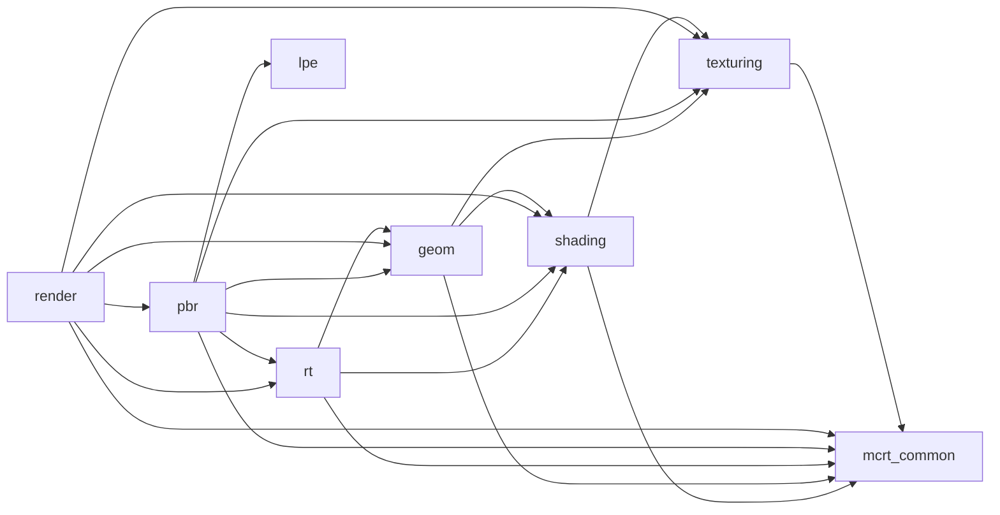

lib/rendering library dependency graph

```mermaid
graph LR
    render-->pbr;
    pbr-->rt;
    render-->rt;
    rt-->geom;
    geom-->shading;
    shading-->texturing;
    texturing-->mcrt_common;
    pbr-->lpe;
    render-->geom;
    pbr-->geom;
    render-->shading;
    pbr-->shading;
    rt-->shading;
    render-->texturing;
    pbr-->texturing;
    geom-->texturing;
    render-->mcrt_common;
    pbr-->mcrt_common;
    rt-->mcrt_common;
    geom-->mcrt_common;
    shading-->mcrt_common;
```
